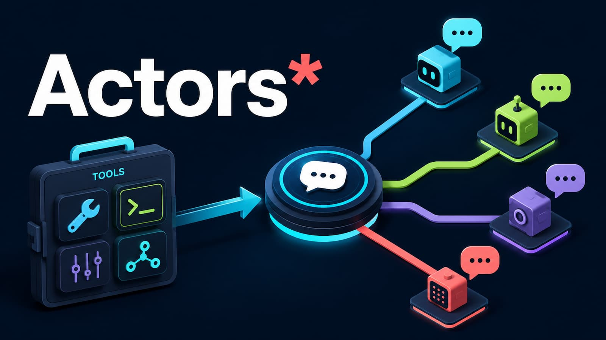

# pi-actors



**Local actor kernel for Pi.**

`pi-actors` turns trusted local programs, scripts, services, pipelines, recipes, and sub-agents into addressable actors that Pi can spawn, steer, inspect, and reuse. It is the bridge between one-shot shell commands and durable local capability memory.

A command is a moment. An actor is a local thing with time: address, lifecycle, logs, mailbox, messages, artifacts, state, and an interaction contract.

```text
trusted local capability
→ command template
→ recipe
→ spawn
→ run:<id>
→ message / inspect / artifacts
→ reusable tool memory
```

## Why it exists

Agents are good at reasoning, but they should not reconstruct the same fragile background command every time a task becomes long-lived. `pi-actors` gives Pi a local-first actor layer: work can outlive the current turn, expose bounded state, receive typed instructions, produce artifacts, and graduate into persistent recipe-backed tools under `~/.pi/agent/recipes`.

Use it when the correct shape is not "run a command and forget" but "start a local capability, keep its handle, and come back with intent."

## The promise

- **Spawn long-lived work without shell gymnastics.** Start services, workers, subagents, fanouts, and pipelines as named actor runs.
- **Steer instead of restarting.** Send typed `message` envelopes to runs, tools, branches, rooms, sessions, or coordinators.
- **Inspect intentionally.** Read status, logs, messages, mailboxes, artifacts, registry health, and room rosters at decision points.
- **Promote what works.** Persist trusted command templates and recipes as durable local tools in `~/.pi/agent/recipes`.
- **Keep orchestration local.** State is file-backed, inspectable, operator-owned, and designed for Pi sessions rather than a cloud broker.

## Core verbs

`pi-actors` compresses local orchestration into three public verbs:

| Verb | Use it when | Result |
| --- | --- | --- |
| `spawn` | Work may outlive this turn, fan out, produce artifacts, or need later steering | A `run:<id>` actor with lifecycle and state |
| `message` | An existing actor should be continued, stopped, approved, killed, or given scoped input | One typed envelope delivered to one address |
| `inspect` | You need evidence before deciding the next step | Bounded views of status, logs, messages, registry, artifacts, or rooms |

Everything else is an adapter until proven otherwise.

## Install

```bash
pi install npm:@llblab/pi-actors
```

Or from git:

```bash
pi install git:github.com/llblab/pi-actors
```

The npm package is dist-first for JavaScript-only runtimes: Pi metadata points at compiled `dist/` entrypoints and mirrored runtime assets. Source TypeScript and source skills remain packaged for TypeScript-native or checkout-based runtimes.

## First run: actor mode in one minute

Use actors instead of ad hoc shell backgrounding when work is long-running, stateful, resumable, artifact-producing, service-like, parallel, agentic, or worth saving.

Start an actor:

```text
spawn template="sleep 30 && echo done" as=run:demo
```

Inspect it when you need evidence:

```text
inspect target=run:demo view=status
inspect target=run:demo view=tail lines=40
```

Steer it with a typed message:

```text
message to=run:demo type=control.kill body=stop
```

For non-trivial actor workflows, load the bundled `actors` skill before improvising. For multi-model review or delegated audit, load the bundled `swarm` skill.

## Address surface

Core addresses stay small:

```text
run:<id>      one detached actor run
tool:<name>   executable registered tool actor
```

Advanced addresses exist for coordination and diagnostics:

```text
branch:<run>/<branch>  branch-local worker endpoint
room:<run>             run-local group timeline plus roster
coordinator            current session coordination path
session:               current session actor surface
session:all            cross-session diagnostics inventory
```

Messages use one envelope shape:

```json
{
  "to": "run:review",
  "from": "coordinator",
  "type": "control.continue",
  "summary": "Continue after checkpoint",
  "body": "continue",
  "reply_to": "msg_123",
  "correlation_id": "task_456",
  "metadata": {}
}
```

Routing comes from `to`, actor ownership, and runtime policy. `type` describes intent. Recipes should expose semantic message types instead of transport knobs.

## Feature showcase

| Surface | What it gives you | Typical move |
| --- | --- | --- |
| Command templates | Portable command graphs with placeholders, defaults, guards, retries, parallel nodes, recovery, and timeouts | Wrap a trusted local executable without writing a bespoke tool |
| Recipes | JSON/Markdown capability specs with metadata, args, defaults, imports, mailbox contracts, artifacts, and async mode | Save a known-good local workflow as reusable muscle memory |
| Async runs | File-backed detached lifecycle, logs, progress, output, cancellation, artifacts, and terminal follow-ups | Let model work, media jobs, services, or pipelines continue after the turn |
| Message protocol | Typed envelopes across run, tool, branch, room, coordinator, and session targets | Continue, approve, kill, or route work without restarting actors |
| Rooms and rosters | Run-local group timeline with actor join/leave, contacts, previews, and branch-aware delivery | Coordinate multiple subagents under one visible run |
| Registry and recipe doctor | Discovered tools, overrides, drafts, invalid recipes, and advisory risk labels | Audit local capability memory before using or promoting it |
| Draft promotion | Captured ad hoc spawn patterns can become explicit recipes after operator approval | Turn successful improvisation into durable local tools |
| Review/swarm recipes | Maintained packaged pipelines with preflight, quorum knobs, model/thinking inheritance, prompt-file transport, and diagnostics | Delegate reviews without rebuilding fanout commands |
| Actor inspector | Compact TUI/debug views for active actor coordination, unread branch inboxes, room messages, and attention markers | Watch only the actor traffic that matters right now |
| Packaged recipe QA | Installed-package-safe checks for helper paths, mailbox contracts, platform scope, artifacts, and recipe structure | Keep shipped actor components executable and diagnosable |

## Golden path: from local workflow to actor memory

Create a reusable async actor recipe in the user recipe root:

```bash
mkdir -p ~/.pi/agent/recipes

cat > ~/.pi/agent/recipes/docs_review.json <<'JSON'
{
  "description": "Start an async docs review actor",
  "async": true,
  "args": ["scope:path", "model:string", "thinking:string"],
  "defaults": { "model": "{current_model}", "thinking": "{current_thinking}" },
  "mailbox": {
    "accepts": ["control.kill", "control.continue"],
    "emits": ["review.completed", "run.failed"]
  },
  "template": "pi -p --model {model} --thinking {thinking} --no-tools \"Review {scope} for unclear actor-runtime onboarding. Return concise findings.\""
}
JSON
```

Because it lives under `~/.pi/agent/recipes/`, the filename becomes the tool id. `{current_model}` and `{current_thinking}` inherit the active Pi session policy; pass explicit values only when a run should intentionally diverge.

Run it:

```text
docs_review scope="README.md" run_id=docs_review
```

Inspect it:

```text
inspect target=tool:pi-actors view=triage
inspect target=run:docs_review view=status
inspect target=run:docs_review view=tail lines=80
inspect target=run:docs_review view=messages
inspect target=run:docs_review view=mailbox
```

Steer it:

```text
message to=run:docs_review type=control.continue body=continue
message to=run:docs_review type=control.kill body=stop
```

## Recipe memory model

The persistent tool surface is location-derived:

```text
~/.pi/agent/recipes/*.json
~/.pi/agent/recipes/*.md
```

Rules:

- User recipes in `~/.pi/agent/recipes/` are tools by location.
- Recipe filenames define tool ids.
- User recipes override same-name lower-priority recipes.
- Same-id JSON recipes shadow Markdown recipes in the same priority layer.
- Packaged recipes are standard-library components, not automatically installed operator policy.
- Draft recipes in `~/.pi/agent/recipes/drafts/` are replayable memory, not active tools.
- `register_tool` creates, updates, lists, deletes, or explicitly promotes draft recipe files through the normal agent interface.

Register a foreground tool:

```text
register_tool name=transcribe_audio \
  description="Transcribe a local audio file" \
  template="~/bin/transcribe {file:path} {lang=ru} {model:string}"
```

Register a recipe-backed tool:

```text
register_tool name=docs_review \
  description="Start an async docs review actor" \
  template="docs_review" \
  args="scope:path,model:string"
```

Promote a captured draft only after explicit operator approval:

```text
register_tool name=docs_review draft=~/.pi/agent/recipes/drafts/spawned-run.json
```

Inspect the registry:

```text
inspect target=recipes view=status
inspect target=recipes view=summary verbose=true
inspect target=tool:pi-actors view=triage
```

## Command templates

A command template is the launch substrate. It can be a string, a sequence, or a composed graph.

Templates support:

- Named placeholders such as `{file}`, `{model}`, `{prompt}`;
- Compact types such as `string`, `path`, `int`, `number`, `bool`, `enum(a,b)`;
- Defaults such as `{lang=ru}` and `{dry_run:bool=true}`;
- Fallback and small ternary forms;
- Sequences with stdin flow;
- Parallel nodes;
- Retries, recovery, failure policy, delays, guards, and timeouts;
- Async run values such as `{run_id}`, `{state_dir}`, `{actor_address}`, `{default_room}`, and `{communication_file}`.

The template owns execution shape. The recipe owns saved metadata, defaults, imports, mailbox, artifacts, and async launch policy. The run actor owns detached lifecycle, state, messages, cancellation, and inspection.

## Packaged recipe library

Packaged recipes live under `recipes/` and helper scripts live under `scripts/`.

The library includes:

- Subagent launchers;
- Review, critic, planner, verifier, merger, judge, normalizer, and artifact atoms;
- Quorum and lens-style pipelines;
- Repo-health, release-summary, research-synthesis, development-tasking, docs-maintenance, and room-swarm pipelines;
- Coordinator-locker and actor-message utilities;
- Local music-player actor recipe.

Packaged recipes are building blocks. Use `spawn file=<recipe>` for maintained packaged pipelines before rebuilding equivalent shell commands. Copy or wrap them into `~/.pi/agent/recipes/` only when they should become durable operator-facing tools.

## Choosing the right surface

| If the work is... | Prefer... |
| --- | --- |
| Short, bounded, and foreground | Ordinary tools or registered foreground tools |
| Long-running, service-like, parallel, agentic, artifact-producing, or controllable | `spawn` / async recipe |
| Already running and needs new input | `message` |
| Unclear, failing, or ready for a decision | `inspect` |
| A multi-actor collaboration under one run | `room:<run>` plus branch addresses |
| A useful output that should survive context compression | Artifacts |
| A repeated local workflow | Recipe/tool memory |

When a directly spawned inline/ad hoc actor or a recipe outside the user recipe root completes successfully, `pi-actors` may send the launching agent a follow-up suggesting promotion. The agent should ask first and never auto-save.

## Platform support

Core actor state, inspection, foreground tools, and basic async runs are portable Node.js behavior. Run-local messaging and stop/kill use platform adapters under the same `message` API.

| Surface | Linux/macOS/WSL | Native Windows |
| --- | --- | --- |
| Foreground tools, recipe discovery, inspect | Supported | Supported |
| Async runs and file-backed state | Supported | Supported |
| Mailbox-only actors and worker recipe | Supported | Supported |
| FIFO control endpoints | Supported | Not supported; use mailbox or named pipe |
| Named-pipe control endpoints | Not needed | Supported when recipe exposes one |
| Process cancel/kill | Process group signal with pid fallback | Windows process-tree adapter |

Packaged recipes should prefer mailbox/wake behavior for portable control. Recipes that require FIFO, Unix shell tools, or platform-specific media backends should make that limitation visible in docs or diagnostics before launch.

## Safety boundary

`pi-actors` is local-first, not sandbox-first.

Commands execute directly without shell evaluation where possible, but trusted executables still run with the same system permissions as Pi. Only register commands, scripts, recipes, and paths you trust.

High-risk templates such as shells, interpreter eval modes, network access, external side effects, and broad filesystem mutation may surface warnings, but the runtime is not a security boundary.

Prefer:

- Narrow commands;
- Explicit paths;
- Typed args;
- Bounded timeouts for bounded work;
- Explicit tool allowlists for subagents;
- Deterministic utility recipes for filesystem writes;
- Human approval for destructive or external side effects.

## Non-goals

`pi-actors` is not:

- A generic workflow DSL;
- A remote agent interoperability protocol;
- A heavyweight broker;
- A sandbox;
- A facade that hides logs, artifacts, ownership, or local side effects;
- A polling-first async runner.

Its job is narrower: make trusted local capabilities addressable, messageable, inspectable, and reusable by agents.

## Documentation

Start here:

- [Project context](./AGENTS.md)
- [Changelog](./CHANGELOG.md)
- [Open backlog](./BACKLOG.md)
- [Documentation index](./docs/README.md)
- [Actors skill](./skills/actors/SKILL.md)
- [Swarm skill](./skills/swarm/SKILL.md)

Core docs:

- [Command templates](./docs/command-templates.md)
- [Template recipes](./docs/template-recipes.md)
- [Async runs](./docs/async-runs.md)
- [Actor messages](./docs/actor-messages.md)
- [Tool registry](./docs/tool-registry.md)
- [Recipe library](./docs/recipe-library.md)

## License

MIT
